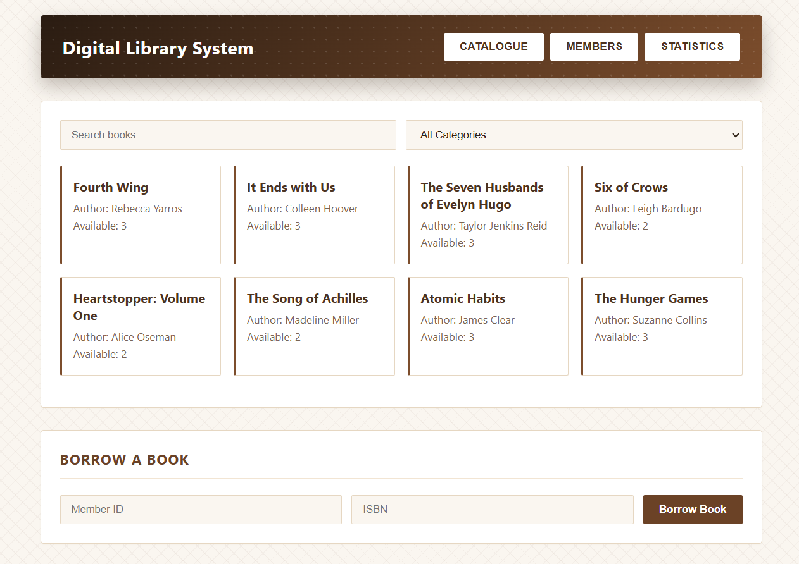
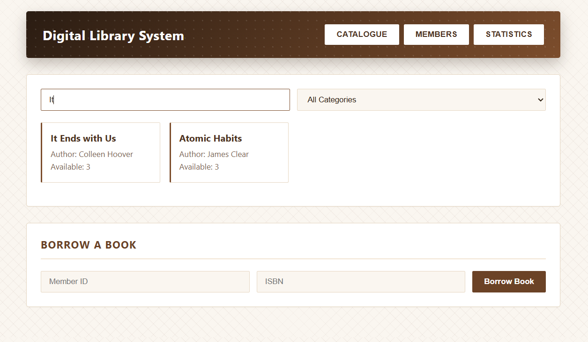
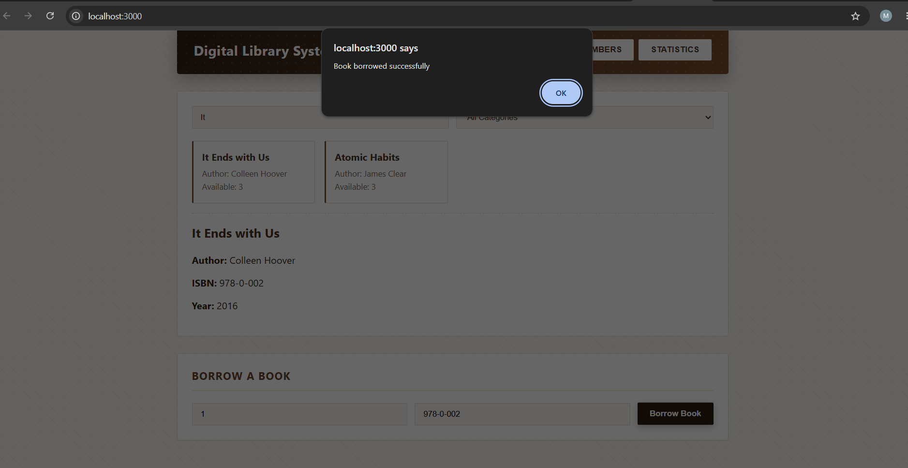
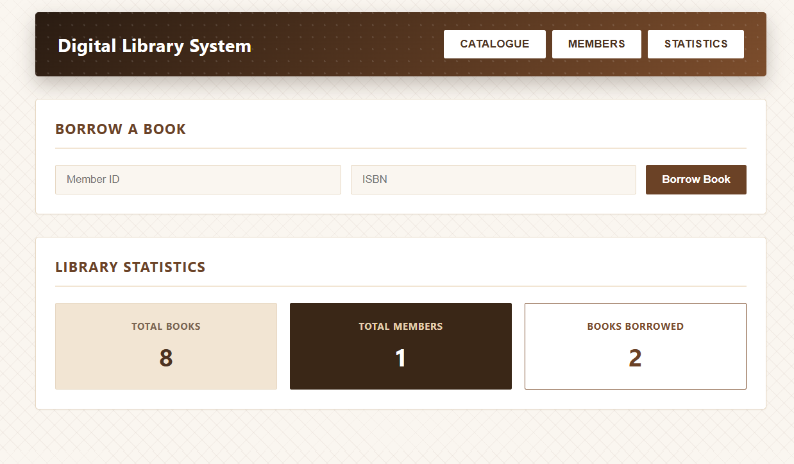
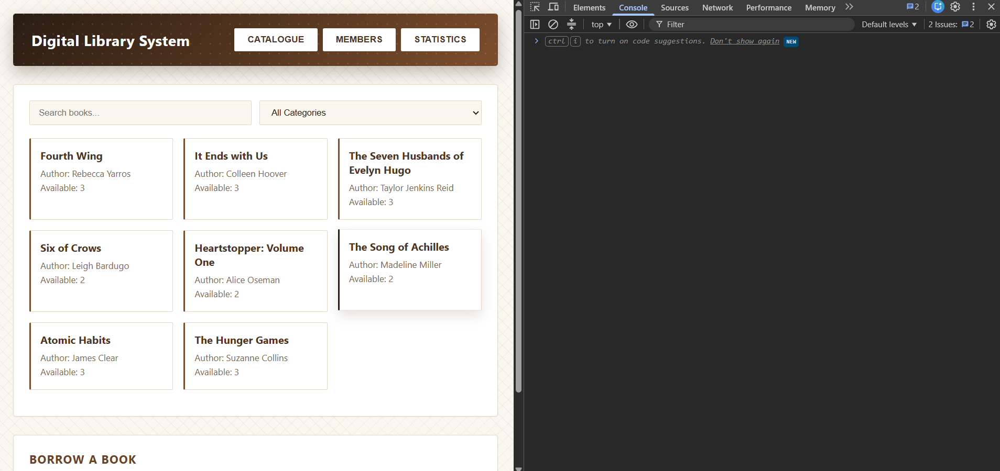
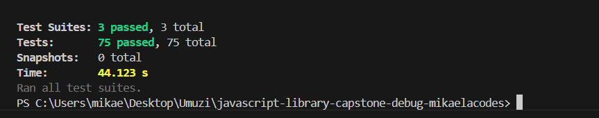
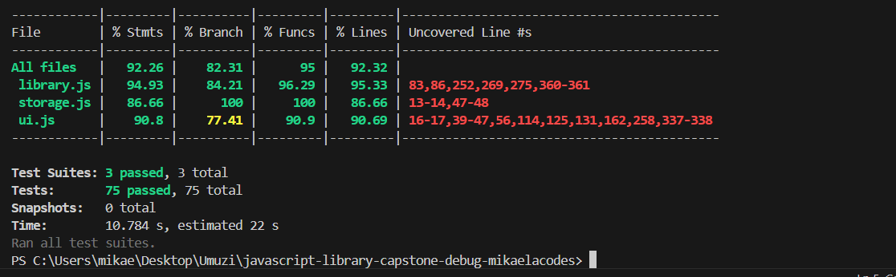

[](https://classroom.github.com/online_ide?assignment_repo_id=24112987&assignment_repo_type=AssignmentRepo)

# Library Management System

A digital library management system rebuilt from a ~55%-complete, intentionally buggy starter codebase into a working, tested application. It manages physical and digital books, standard and premium members, borrowing/returns, late fees, and library statistics, backed by `localStorage` persistence.

## Critical Errors Found

**Critical (broke functionality):**
1. `library.js` — `books`/`MAX_BOOKS_PER_MEMBER` were undeclared globals.
2. `DigitalBook` constructor never called `super()` — threw on every instantiation.
3. `Member.canBorrow` used `=` instead of `===`, corrupting `borrowedBooks.length`.
4. `processReturnQueue`'s loop never incremented its index — infinite loop.
5. `searchBooksByCategory` had no recursion base case — read past array bounds.
6. `borrowBook` never checked if `member`/`book` lookups returned `null`.
7. `ui.js` selector `querySelector("filter-category")` was missing `#`, so it always returned `null`.
8. `initializeUI()` ran before `DOMContentLoaded`, before `books`/`members` existed.
9. `saveToLocalStorage` stored objects directly without `JSON.stringify` (`"[object Object]"`).
10. `importLibraryData`/`loadFromLocalStorage` called `JSON.parse` with no `try-catch`.
11. `styles.css` was referenced by `index.html` but didn't exist.

**Major (incorrect behaviour):**
12. `getBooksByAuthor`/`findMemberById` used `==`/`=` instead of `===`.
13. Filter dropdown listened for `"click"` instead of `"change"`.
14. Form submit handler was missing `event.preventDefault()`, causing page reloads.
15. `Book.checkOut` never validated `availableCopies` before decrementing.
16. `renderBookCatalogue` never cleared its container, so cards accumulated on re-render.
17. `LibraryStats` was missing `getAverageCheckoutsPerBook`, `getSummary`, and `getMostPopularBook`.
18. All string building used `+` concatenation instead of template literals.
19. `var` was used throughout instead of block-scoped `let`/`const`.
20. `createMemberForm`'s email field had `type="text"` instead of `type="email"`.

**Minor (optimisation/quality):**
21. ISBN lookups used a linear `for` loop instead of a `Map` for O(1) access.
22. Test suite had only 3 real assertions; the rest were comment placeholders.

## Fixes Implemented

- **Variables & Operators**: all declarations converted to `let`/`const`; every `==`/`=` comparison bug fixed to `===`; added `typeof`/`null` guards on `borrowBook`, `findMemberById`, `findBookByISBN`, `calculateFineAmount`.
- **Control Flow**: infinite `while` replaced with a bounded `for...of`; 5 `for...of` loops added across stats and rendering code.
- **Functions**: `searchBooksByCategory` and `findOverdueBooks` are proper recursive functions with base cases; `getBooksByAuthor`, `calculateTotalLateFees`, `getMostPopularBook` rewritten with `filter`/`reduce`; `withLogging` and `createBookFilter` added as higher-order functions.
- **OOP**: `Book` gained `availableCopies`/`totalCopies`, `isAvailable()`, `getInfo()`; `DigitalBook` now calls `super()` correctly; `Member` gained `joinDate`, `getMembershipDuration()`, `getMemberInfo()`; `PremiumMember` overrides `canBorrow()` for a 10-book limit.
- **DOM & Events**: fixed all selectors, added `DOMContentLoaded` bootstrapping, `change` listener on the filter, `event.preventDefault()` on both forms, and event delegation via `closest()` on the catalogue and nav containers.
- **Storage**: `exportLibraryData`/`importLibraryData`/`saveToLocalStorage`/`loadFromLocalStorage` all wrapped in `try-catch` with `JSON.stringify`/`JSON.parse` and shape validation.

## Modern Features Added

Destructuring (object, array, and parameter forms), template literals throughout string/HTML building, spread (`combineBookCollections`, array copies), rest parameters (`addMultipleBooks`, `withLogging`), and a 3-module ES module split.

## Architecture Improvements

Logic is split into `src/library.js` (domain model: classes, stats, business rules), `src/storage.js` (JSON/localStorage persistence), and `src/ui.js` (DOM/event layer) — each importing only what it needs.

## Installation & Setup

```bash
npm install
```

## Running the Application

Serve the project root with any static server (the app uses `fetch` for seed data, which `file://` blocks), e.g.:

```bash
npx serve .
```

Then open the printed `localhost` URL.

## Running Tests

```bash
npm test                    # run all tests
npm test -- --coverage      # run with coverage report
```

75 Jest tests across `library.test.js`, `storage.test.js`, and `ui.test.js` (jsdom) cover classes, recursion, array methods, JSON/localStorage, and DOM/event handling. Coverage: 92.3% stmts, 82.3% branches, 95% funcs, 92.3% lines.

## Key API

- `new Book(isbn, title, author, year, copies)` / `book.checkOut(memberId)` / `book.isAvailable()` / `book.getInfo()`
- `new DigitalBook(...bookArgs, fileSize, format)` / `digitalBook.download(memberId)`
- `new Member(id, name, email, membershipType)` / `member.canBorrow()` / `member.getMemberInfo()`
- `borrowBook(memberId, isbn)` — validates input, looks up member/book, checks eligibility
- `LibraryStats.getSummary()`, `.getMostPopularBook()`, `.getAverageCheckoutsPerBook()`
- `saveToLocalStorage()` / `loadFromLocalStorage()` / `exportLibraryData()` / `importLibraryData(json)`

## Screenshots

| | |
|---|---|
|  Catalogue |  Search |
|  Borrow |  Statistics |
|  Console |  Tests |
|  Coverage | |

## Reflection

The hardest bug to track down was `DigitalBook`'s missing `super()` call combined with `searchBooksByCategory`'s missing base case — both failed silently until traced with targeted `console.log`s and a test-first approach: write the assertion for correct behaviour, watch it fail, then fix. That was the most reliable strategy throughout, especially for the operator bugs (`=` vs `===`) that produced no errors, just wrong data.
